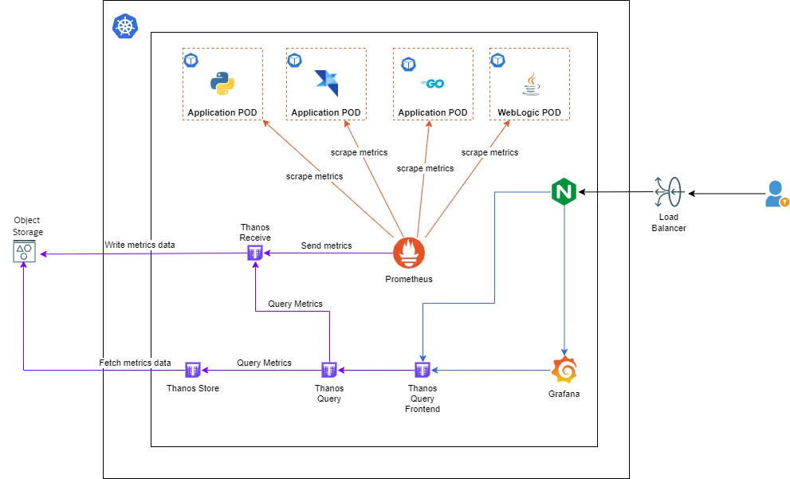

# Instalando e Configurando Prometheus + Thanos


## 1 - Configurando acesso ao Storage Cloud

1 - Vamos criar o `storage.yaml` arquivo de configuração de acesso ao BLOB, S3..... 

```
type: AZURE
config:
    storage_account: 'zzzz'
    storage_account_key: 'xxxx'
    container: 'yyyy'
```

2 - Vamos executar o comando criar o Secret baseado nas informações do arquivo que acabamos de criar.

```shell
$ kubectl -n monitoring create secret generic thanos-objstore-config --from-file=thanos.yaml=thanos.yaml
``` 

## Instalando e Configurando o Thanos
3 - Vamos adicionar o repositório do Bitnami nvia `helm`
```shell
$ helm repo add bitnami https://charts.bitnami.com/bitnami
```

4 - Vamos gerar o arquivo `yaml` de instalação do Thanos e fazer algumas alterações antes de instalar:
```shell
$ helm show values bitnami/thanos > thanos.yaml
```

5 - Edite o arquivo `thanos.yaml` com os seguintes parametros:

``` 
image
  tag: 0.29.0
existingObjstoreSecret: "thanos-objstore-config"    
queryFrontend:
  enabled: true
bucketweb:
  enabled: true
compactor:
  enabled: true
storegateway:
  enabled: true
receive:
  enabled: true
```

```
nodeSelector:
    app: thanos
``` 


6 - Vamos instalar o Thanos através do seguinte comando: 
```$
helm upgrade thanos bitnami/thanos --values value.yaml
``` 


17 - Vamos criar o Serviço o Ingress do o Thanos Receive para que o Prometheus consiga enviar as informações:
    
> Primeiro vamos criar o serviço Remote Write no Kubernetes. Criamos o arquivo `thanos_receive.yaml` e adicionamos as seguintes informações:
```
apiVersion: v1
kind: Service
metadata:
  name: thanos-receive-api
  namespace: monitoring
  labels:
    app.kubernetes.io/component: receive
    app.kubernetes.io/instance: thanos
    app.kubernetes.io/managed-by: Helm
    app.kubernetes.io/name: thanos
    helm.sh/chart: thanos-12.4.2
  annotations:
    meta.helm.sh/release-name: thanos
    meta.helm.sh/release-namespace: monitoring
  selfLink: /api/v1/namespaces/monitoring/services/thanos-receive
status:
  loadBalancer: {}
spec:
  ports:
    - name: remote
      protocol: TCP
      port: 19291
      targetPort: 19291
  selector:
    app.kubernetes.io/component: receive
    app.kubernetes.io/instance: thanos
    app.kubernetes.io/name: thanos
  #type: LoadBalancer
  sessionAffinity: None
  ipFamilies:
    - IPv4
  ipFamilyPolicy: SingleStack
  internalTrafficPolicy: Cluster
  ```

Agora vamos fazer o deploy desse arquivo no kubernetes:
```shell
$ kubectl apply -f thanos_receive.yaml
``` 

> Vamos criar o arquivo de instalação do Ingress no Kubernetes. `thanos_receive_ingress.yaml`
```
apiVersion: networking.k8s.io/v1
kind: Ingress
metadata:
  name: thanos-receive-ingress
  annotations:
    kubernetes.io/ingress.class: nginx
    nginx.ingress.kubernetes.io/rewrite-target: /$2
    nginx.ingress.kubernetes.io/service-upstream: "true"
status:
  loadBalancer:
    ingress:
      - ip: 12.34.123.1234 # IP do Load Balance 
spec:
  defaultBackend:
    resource:
      kind: Service
      name: thanos-receive-api
  ingressClassName: nginx
  rules:
    - http:
        paths:
          - path:  /thanos(/|$)(.*)
            pathType: Prefix
            backend:
              service:
                name: thanos-receive-api
                port:
                  number: 19291
```

Agora vamos fazer o deploy desse arquivo no kubernetes:
```shell
$ kubectl apply -f thanos_receive_ingress.yaml
```

Para verificar se está funcionando execute uma chamada para o endereço do Ingress da seguinte forma:

```shell 
$ curl http://{IP_INGRESS}/thanos/api/v1/receive
```

A resposta deve ser um 400 com a seguinte mensagem:

```
snappy decode error: s2: corrupt input
``` 

## Instalando e Configurando o Prometheus
8 - Vamos adicionar o repositório da stack do Prometheus para instalarmos
```shell
$ helm repo add kps https://prometheus-community.github.io/helm-charts
```
9 - Vamos gerar o arquivo de instalação e editar algumas partes:
```shell
$ helm show values kps/kube-prometheus-stack > kps.yaml
```
10 - Vamos editar o arquivo `kps.yaml` e procurar pelos campos e alterar deixando dessa maneira:

```
prometheus
  prometheusSpec
    serviceMonitorSelectorNilUsesHelmValues: false
    podMonitorSelectorNilUsesHelmValues: false
    remoteWrite:
     - url: http://thanos-receive.monitoring.svc.cluster.local:19291/api/v1/receive
```

```    
prometheusSpec
    nodeSelector:
        app: prometheus
```

11 - Agora vamos fazer a instalação do Prometheus com as alterações que fizemos:
```shell
$ helm install prometheus kps/kube-prometheus-stack --namespace monitoring -f kps.yaml
```

12 - Acesse o os Logs do Prometheus e verifique se os arquivos estão sendo enviados e depois acesse o Thanos Query FrontEnd e verifique se as informações referentes aos cluster estão lá.

## URLs
https://medium.com/oracledevs/deploy-thanos-receive-with-native-oci-object-storage-on-kubernetes-829326ea0bc6

https://techcommunity.microsoft.com/t5/apps-on-azure-blog/store-prometheus-metrics-with-thanos-azure-storage-and-azure/ba-p/3067849